# HTTP/2: Performance Real

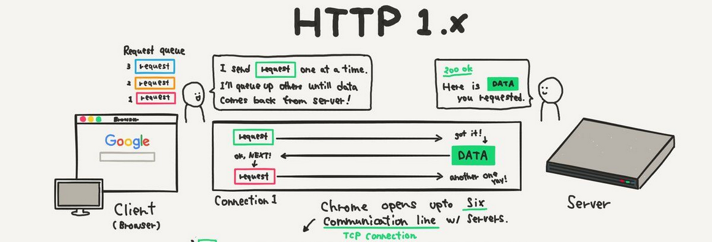

> *Este artigo é baseado na apresentação "HTTP/2: +Performance" apresentada no FliSol 2024.*

Se você é desenvolvedor ou trabalha com infraestrutura web, já deve ter sentido que uma página que deveria carregar em segundos leva mais tempo do que o esperado. A primeira reação é culpar o JavaScript, o tamanho das imagens, a conexão do usuário. Mas, existe um fator que muitas vezes fica escondido atrás dessas camadas: o protocolo de aplicação.

A web cresceu. Segundo o [HTTP Archive Web Almanac 2024](https://almanac.httparchive.org/en/2024/page-weight), as páginas desktop pesam em média **2.652 KB** (~2,6 MB) e carregam **~71 recursos na mediana** — chegando a mais de 170 nos sites mais pesados. O HTTP/1.1, nascido em 1997, não foi projetado para essa realidade. Ele sobreviveu por quase duas décadas com "puxadinhos" — múltiplas conexões paralelas, *sprites* de imagem, *domain sharding* — mas chegou o limite.

O HTTP/2 não é uma evolução incremental. É uma **reestruturação completa** de como os dados trafegam entre cliente e servidor. A diferença é substancial e carece de nossa atenção para o entendimento do funcionamento desta versão.

### Internet vs Web

Antes de entrar no protocolo, é importante separar dois conceitos que muita gente confunde: **Internet ≠ World Wide Web**.

A Internet é a infraestrutura — o TCP/IP, os roteadores, os cabos. A Web é a camada de aplicação que roda sobre ela e que todo mundo vê: páginas, links, imagens. O HTTP é o protocolo que faz essa ponte funcionar.

Tim Berners-Lee e sua equipe no CERN desenvolveram o primeiro protótipo do HTTP entre 1989 e 1991. A ideia era simples: permitir que pesquisadores compartilhassem documentos de forma padronizada. O que ninguém imaginava em 1991 é que, mais de três décadas depois, essa mesma especificação básica ainda sustentaria bilhões de requisições por dia.

### Linha do tempo

#### HTTP/0.9 (Agosto de 1991)

O primeiro HTTP era tão minimalista que não tinha headers, códigos de status ou body estruturado. Uma única linha:

```cli
GET /mydoc.html
```

E a resposta era o conteúdo HTML puro. Sem metadados. Sem controle. Funcionou enquanto a web era composta por poucas páginas estáticas em laboratórios de pesquisa:

```html
<html>
  A very simple HTML page
</html>
```

#### HTTP/1.0 (Maio de 1996)

O HTTP/1.0 trouxe métodos (`GET`, `POST`), headers, códigos de status e suporte a múltiplos tipos de conteúdo. Pela primeira vez, era possível enviar uma página HTML com imagens embutidas em requisições separadas:

```cli
GET /mypage.html HTTP/1.0
User-Agent: NCSA_Mosaic/2.0 (Windows 3.1)
```

*Response*:

```cli
200 OK
Date: Tue, 15 Nov 1994 08:12:31 GMT
Server: CERN/3.0 libwww/2.17
Content-Type: text/html
<HTML>
A page with an image
  
</HTML>
```

Cada recurso precisava de uma nova conexão. Se a página tinha uma imagem, o navegador abria outra conexão TCP e fazia outro `GET`. Era funcional, mas ineficiente.

### HTTP/1.1 (Janeiro de 1997)

O HTTP/1.1 trouxe melhorias que ainda são a base do desenvolvimento web moderno:

- **Conexões persistentes** (`keep-alive`) — reutilizar a mesma conexão TCP
- **Pipelining** — enviar múltiplas requisições na mesma conexão (pouco usado na prática)
- **Chunked transfer encoding** — body com tamanho desconhecido
- **Cache control** via headers — `Cache-Control`, `ETag` e `Last-Modified`
- **Novos headers**: `Host`, `Accept-Encoding`
- **Segurança**: `CORS` (*Cross-Origin Resource Sharing*) e `CSP` (*Content Security Policy*)

O HTTP/1.1 se tornou tão onipresente que arquiteturas inteiras foram construídas sobre ele: **SOA** (Service-Oriented Architecture), **REST** (Representational State Transfer). Porém, a performance dava um tom limitante na transferência de recursos.

> *"Temos um HTTP na versão 1.1 muito bem funcional e conhecido na Web, além de padrões de desenvolvimento como SOA e REST construídos sobre ele, porém não tão performático."*

> **Tecnologias entre versões do HTTP:** SSL da Netscape em 1994 para um HTTP +seguro que depois virou o TLS, Server-sent events. Ajax, WebSocket entre outros.

### SPDY (2009)

Antes do HTTP/2, existiu o **SPDY** (*"speedy"*), um protocolo experimental criado por Mike Belshe e Robert Peon da Google em 2009 que apresentou novos mecanismos que foram depois incorporados ao HTTP/2. O objetivo era simples: resolver os gargalos de performance do HTTP/1.1.

O SPDY introduziu três mecanismos importantes:

| Conceito | O que faz |
|----------|-----------|
| *Multiplexação* | Múltiplos recursos na mesma conexão TCP |
| *Priorização* | Definir quais recursos são mais importantes |
| *Compressão de headers* | Reduzir o overhead dos metadados |

O resultado foi impressionante: **até 64% de redução no tempo de carregamento** nas condições ideais de teste (link DSL, single-domain com server hint), conforme documentado no [SPDY Whitepaper](https://www.chromium.org/spdy/spdy-whitepaper). O SPDY provou que o HTTP poderia ser muito mais rápido — e que conceitos antes exclusivos da camada de transporte (TCP) poderiam ser aplicados na camada de aplicação.

Em maio de 2015, foi publicado o **HTTP/2 (RFC 7540)** — essencialmente o SPDY oficializado como padrão IETF.

### HTTP/1.1: Estrutura

O HTTP/1.1 é um protocolo **textual**. Cada mensagem é composta por três partes separadas por CRLF (Carriage Return, byte 13, e Line Feed, byte 10): os headers e o body formam, juntos, o que chamamos de *entity* (entidade).

| Parte | Função |
|-------|--------|
| *Start Line* | Request: *"o que fazer"* (`GET /index.html HTTP/1.1`). Response: *"o que aconteceu"* (`200 OK`) |
| *Headers* | Campos nome-valor separados por dois pontos (`Content-Type: text/html`) |
| *Body* | O conteúdo da entidade (HTML, imagem, JSON) |

| 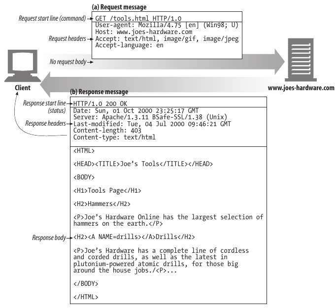 |
| :--: |
| Anatomia do HTTP/1.1 |

Cada caractere, cada espaço, cada `\r\n` é processado pelo navegador, *client*, e pelo servidor. Headers são repetidos a cada requisição. Se você tem 20 headers de 500 bytes cada e faz 100 requisições, são **1 MB de metadados** trafegando na rede.

### HTTP/2: Binário

No HTTP/2, as mesmas três partes continuam existindo (start line, headers, body). Mas, a forma como são transmitidas muda completamente: **frames binários**, multiplexados sobre uma conexão única.

Em vez de texto legível por humanos, os dados são codificados em frames que são mais eficientes para processamento por máquina:

- **Menos ambiguidade** — parsers binários não precisam interpretar texto.
- **Headers comprimidos** via [HPACK](https://www.rfc-editor.org/rfc/rfc7541) (redução típica de 80-90%).
- **Multiplexação nativa** — zero overhead de conexão adicional.
- **Flow control** — controle granular de fluxo por stream.
- **Server Push** — capacidade do servidor enviar recursos para o cliente antes mesmo de serem solicitados.

> **Ponto fundamental:** as três partes da mensagem HTTP continuam as mesmas. A diferença está em *como* são transmitidas. É como comparar uma carta postal (HTTP/1.1) com um envelope digital compactado (HTTP/2).

### HTTP e Modelo OSI

É importante notar que o HTTP opera na **Camada 7 (Aplicação)** do modelo OSI. O transporte de dados depende da camada de transporte subjacente — tipicamente TCP (Camada 4).

| 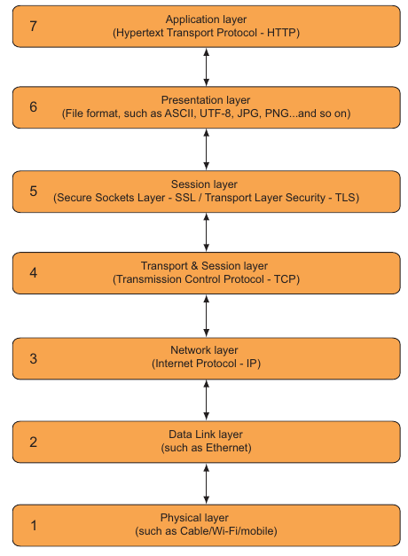 |
| :--: |
| Modelo OSI — posicionamento do HTTP nas camadas de rede |

O HTTP/2 não muda a camada OSI do protocolo. Ele redefine *como* os dados são estruturados e multiplexados dentro da conexão TCP existente. A melhoria de performance vem da eficiência do protocolo de aplicação, não de uma mudança na infraestrutura de rede.

Isso significa que a migração para HTTP/2 não exige mudanças na rede, nos firewalls ou nos servidores proxy — apenas no servidor web e na configuração TLS.

### HTTP/1.1: Limitações

A RFC 2616 (junho de 1999) orientava que clientes abrissem **no máximo 2 conexões persistentes** para qualquer servidor ou proxy. Essa premissa fazia sentido em 1999, quando páginas tinham cerca de 5-10 recursos.

A web mudou. A RFC 7230 (junho de 2014) relaxou a recomendação, e os navegadores modernos tendem a limitar **6 conexões simultâneas por domínio**. O Firefox expõe esse limite na propriedade `network.http.max-persistent-connections-per-server`, com valor 6 por padrão.

O problema é escalar: se uma página moderna tem 100 recursos de um mesmo domínio, e o navegador abre no máximo 6 conexões, **94 recursos ficam esperando na fila**. Logo, percebe-se a existência de um *blocking* no esquema de *input/output* da conexão. No HTTP/2 este bloqueio não existe, o modelo é *non-blocking*.

| 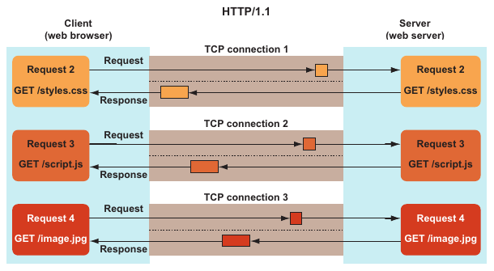 |
| :--: |
| HTTP/1.1: Múltiplas conexões em paralelo (*HTTP/2 in Action, Barry Pollard. Manning Publications, 2019*) |

No HTTP/1.1, os navegadores limitam a 6 conexões simultâneas por domínio. Os recursos excedentes ficam na fila (*stalled*), aguardando uma conexão liberar.

E se a página referencia recursos de outros domínios? Cada domínio adicional gera novas conexões. O resultado é: dezenas de conexões TCP abertas, cada uma com seu handshake TLS, consumindo memória no servidor e na rede.

### HTTP/2: Multiplexação

No HTTP/2, todos os recursos trafegam em **streams** dentro de uma única conexão TCP. Cada stream é identificado por um `stream ID` e dividido em `frames` (análogos a pacotes TCP). Quando o cliente recebe todos os frames de um stream, ele reassembla a mensagem HTTP completa.

| 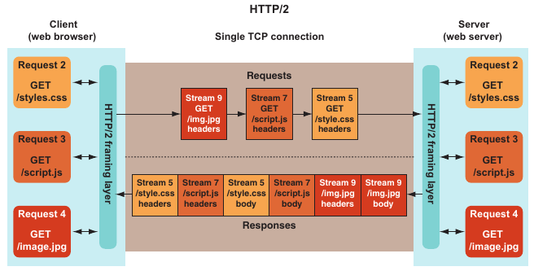 |
| :--: |
| HTTP/2: Conexão multiplexada (*HTTP/2 in Action, Barry Pollard. Manning Publications, 2019*) |

Resultado: **um único handshake TCP**, zero blocking entre input/output e throughput significativamente mais eficiente.

> O HTTP/2 não elimina o blocking do TCP (perda de pacote em um stream bloqueia todos). Elimina apenas o blocking da camada de aplicação.

### Benchmarks: HTTP/1.1 vs HTTP/2

> *Testes de benchmark realizados entre 08/04 e 09/04/2024.*

Para demonstrar a diferença na prática, realizei testes comparativos utilizando o [Tune The Web Performance Test](https://www.tunetheweb.com/performance-test-360) — uma ferramenta que solicita **a mesma imagem 360 vezes**, variando apenas um parâmetro de query (`?count=1` até `?count=360`).

#### HTTP/1.1: Testes

| 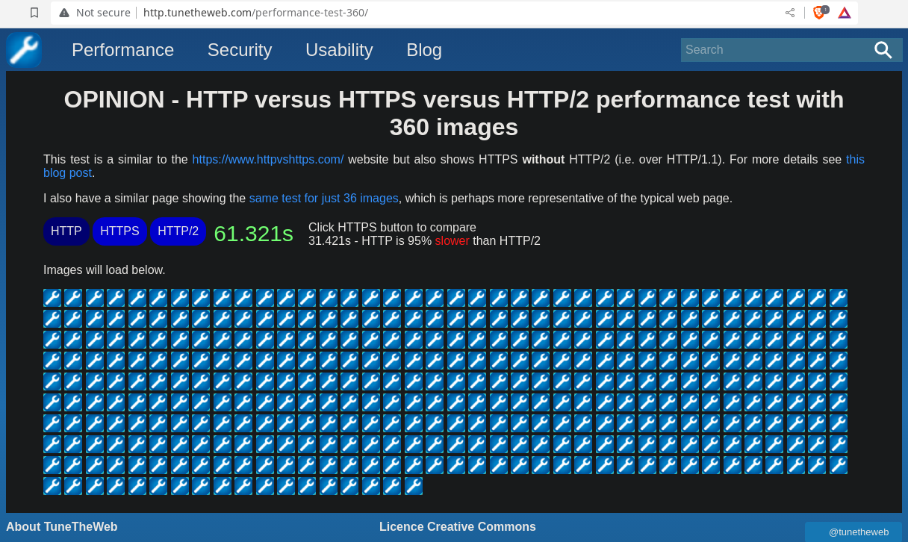 |
| :--: |
| *Tune The Web: HTTP Performance Test* |

```text
Tempo total: 61,321 segundos
Conexões simultâneas: 6 por domínio (limitação do navegador)
```

A inspeção pelo Chrome DevTools revela o problema na prática: múltiplas conexões TCP abertas em paralelo, com a maioria dos recursos esperando na fila de conexão. O *waterfall* mostra claramente os tempos de *stalled* — tempo gasto apenas esperando uma conexão livre.

| 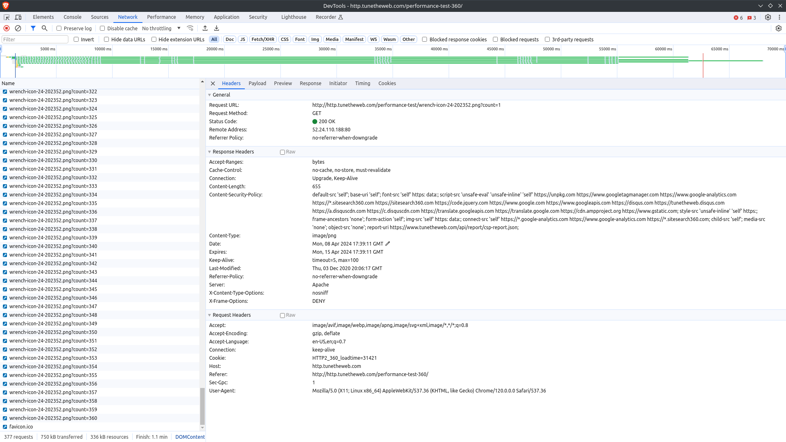 |
| :--: |
| Chrome DevTools — Waterfall do teste HTTP/1.1 |

#### HTTP/2: Testes

| 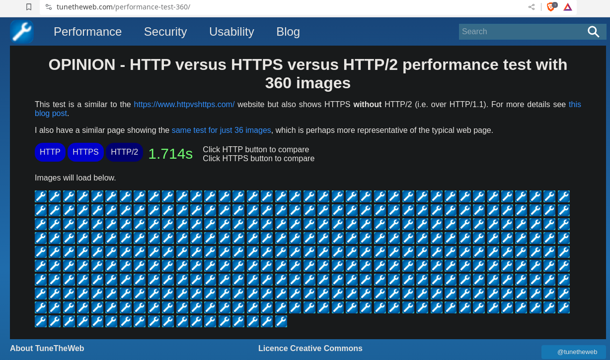 |
| :--: |
| Tune The Web — Resultado HTTP/2: 1,7s para 360 requisições |

*O mesmo teste com HTTP/2 apresenta uma redução de ~97% no tempo total. A diferença vem da multiplexação sobre uma única conexão TCP.*

```text
Tempo total: 1,714 segundos
Conexões simultâneas: 1 (uma única conexão TCP)
```

**Redução de ~97% no tempo total.** De 61 segundos para menos de 2 segundos.

A inspeção pelo DevTools confirma: apenas **1 conexão TCP** ativa, com todos os streams trafegando multiplexados. Não há fila de espera. Não há conexões extras abertas.

| 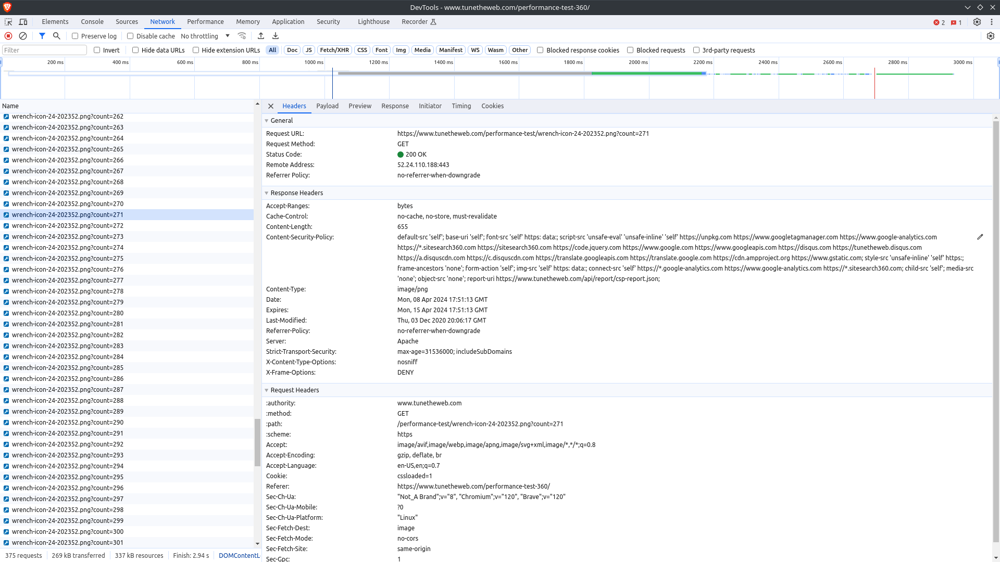 |
| :--: |
| Chrome DevTools — Waterfall do teste HTTP/2 |

*Com HTTP/2, todas as 360 requisições compartilham o mesmo Connection ID. Não há fila de espera, *stalled* — apenas uma conexão TCP processando todos os streams em paralelo.*

#### HTTP2 Demo

O site [http2demo.io](https://http2demo.io) faz um teste semelhante: carrega uma imagem composta por **170 imagens menores** e dispara sequências de requisições para compor o resultado visual.

|  |
| :--: |
| HTTP2 Demo — Imagem composta por 170 recursos |

A inspeção pelo Chrome DevTools (com as colunas *Method*, *Protocol*, *Time* e *Connection ID* habilitadas) revela três pontos cruciais:

1. **Protocolo `h2`** — todas as requisições usam HTTP/2.
2. **Mesmo Connection ID** (`477021`) — todas compartilham a mesma conexão TCP.
3. **Waterfall uniforme** — a diferença de tempo entre *Queueing* (retângulo branco), *Stalled* (cinza), *Waiting* (verde) e *Content Download* (azul) é mínima, indicando que não há fila de espera significativa — [Chrome DevTools: Network Timing Explanation](https://developer.chrome.com/docs/devtools/network/reference/?utm_source=devtools#timing-explanation).

| 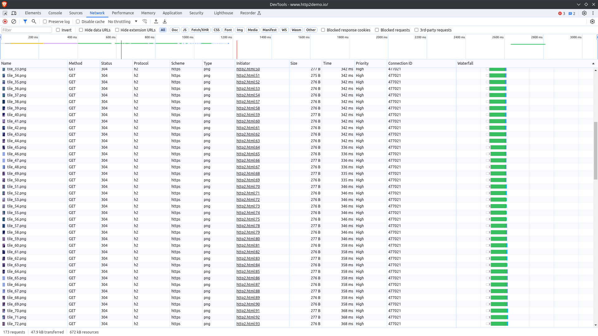 |
| :--: |
| Chrome DevTools — HTTP/2 no http2demo.io |

### Peso das Páginas Web

Os dados do [HTTP Archive](https://httparchive.org/reports/state-of-the-web) mostram a escala do problema:

| 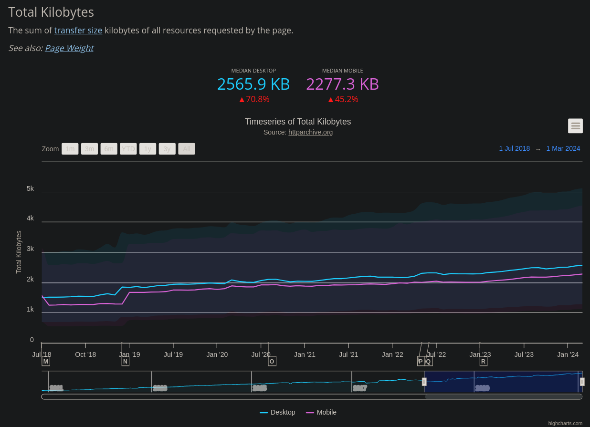 |
| :--: |
| Crescimento do peso das páginas web (HTTP Archive) |

*O peso médio das páginas desktop cresceu de ~500 KB em 2013 para 2.652 KB (~2,6 MB) em 2024 — um aumento de mais de 400%. No mobile, a média é de 2.311 KB. Fonte: [HTTP Archive Web Almanac 2024](https://almanac.httparchive.org/en/2024/page-weight).*

| 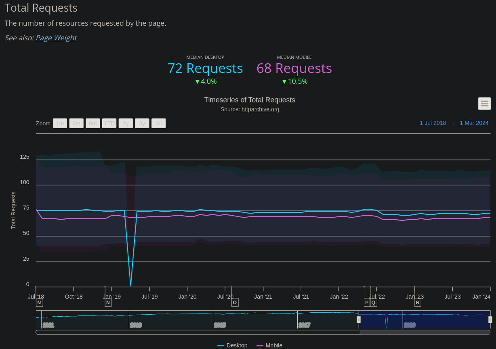 |
| :--: |
| Número de requisições por página ao longo dos anos (HTTP Archive) |

*O número de recursos por página aumentou consistentemente: a mediana em desktop é de ~71 requisições, mas no percentil 90 ultrapassa 170. Cada recurso representa uma requisição HTTP independente — e sob HTTP/1.1, cada um pode significar uma nova conexão TCP.*

### Suporte dos navegadores

O suporte ao HTTP/2 é universal entre navegadores modernos. A tabela abaixo mostra quando cada um adicionou suporte:

| Navegador | Primeira versão com HTTP/2 | Ano |
|-----------|---------------------------|-----|
| Chrome | 41+ | Jan 2015 |
| Firefox | 36+ | Jan 2015 |
| Safari | 9+ (parcial), 11+ (completo) | Mar 2015 / Set 2017 |
| Edge | 12+ | Jul 2015 |
| Opera | 28+ | Jan 2015 |

*Fonte: [Can I Use — HTTP/2](https://caniuse.com/http2)*

| 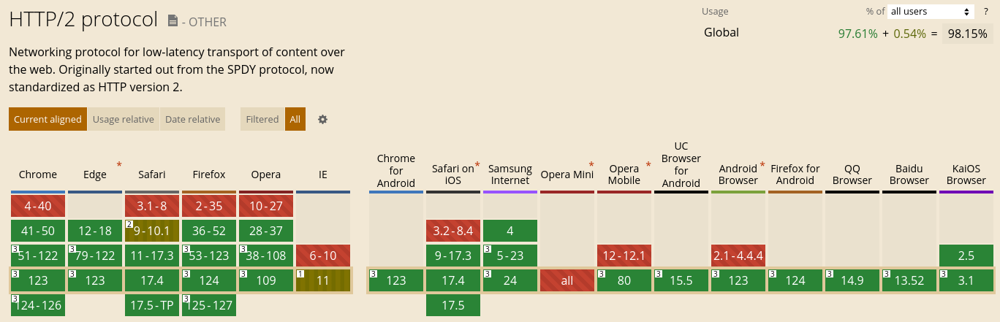 |
| :--: |
| Compatibilidade do HTTP/2 nos navegadores (Can I Use) |

*Tabela de compatibilidade mostrando que todos os navegadores modernos suportam HTTP/2. Chrome e Firefox lideraram em janeiro de 2015, seguidos por Safari, Edge e Opera.*

Praticamente **todos os navegadores hoje suportam HTTP/2**. A barreira não é mais o cliente — é a configuração do servidor.

### Adoção do HTTP/2

Segundo o [W3Techs](https://w3techs.com/technologies/details/ce-http2), o HTTP/2 é utilizado por **35,2% de todos os sites** monitorados. O crescimento foi exponencial desde 2015, atingindo um pico de ~50% antes de uma leve queda — reflexo da migração gradual para o HTTP/3 (QUIC).

| 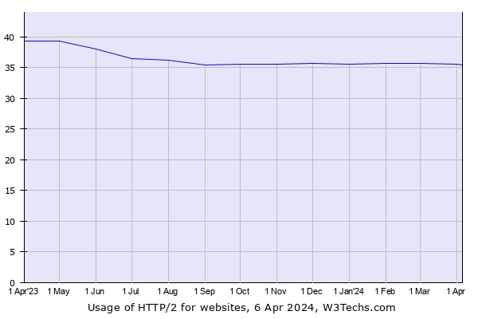 |
| :--: |
| Evolução da adoção do HTTP/2 na web (W3Techs) |

### Verificação do HTTP/2

Existem várias formas de verificar o suporte ao HTTP/2. Vou mostrar as mais práticas.

#### Ferramentas online

| Ferramenta | URL | O que faz |
|------------|-----|-----------|
| Google HTTP Dev | [http.dev/2/test](https://http.dev/2/test) | Teste oficial do Google |
| KeyCDN | [tools.keycdn.com/http2-test](https://tools.keycdn.com/http2-test) | Teste simples e rápido |
| HTTP/2 Pro (**DESCONTINUADO**) | [http2.pro](https://http2.pro) | Análise detalhada com waterfall |

#### curl

Você pode verificar o suporte via [curl](https://curl.se/docs/manpage.html), force uma requisição HTTP/2 ao servidor e observe se o response é igual a **2**. No exemplo de comando foi adicionado *-k* (ignorar validação de certificado)  e *-v* (logar todo o fluxo da requisição):

```bash
curl --http2 -k -v -I -s -o /dev/null -w "%{http_version}\n" https://debian.org
```

**Response:**

```text
* Host debian.org:443 was resolved.
...
* ALPN: curl offers h2,http/1.1
...
* using HTTP/2
...
> HEAD / HTTP/2
> Host: debian.org
> User-Agent: curl/8.20.0
> Accept: */*
> 
* Request completely sent off
...
< HTTP/2 302 
< server: Varnish
< retry-after: 0
< location: https://www.debian.org/
< accept-ranges: bytes
...
< content-length: 0
< 
{ [0 bytes data]
* Connection #0 to host debian.org:443 left intact
2
```

Percebe-se no log da requisição a ocorrência de HTTP/2 no envio e, também, na resposta — o valor 2.

#### h2spec: Conformidade

A ferramenta [h2spec](https://github.com/summerwind/h2spec) é citada no repositório oficial do [IETF HTTP Working Group](https://github.com/httpwg/http2-spec) e valida se uma implementação está em conformidade com as especificações do HTTP/2 (RFC 7540).

```bash
./h2spec -t -k -S -h apache.org -p 443
```

| 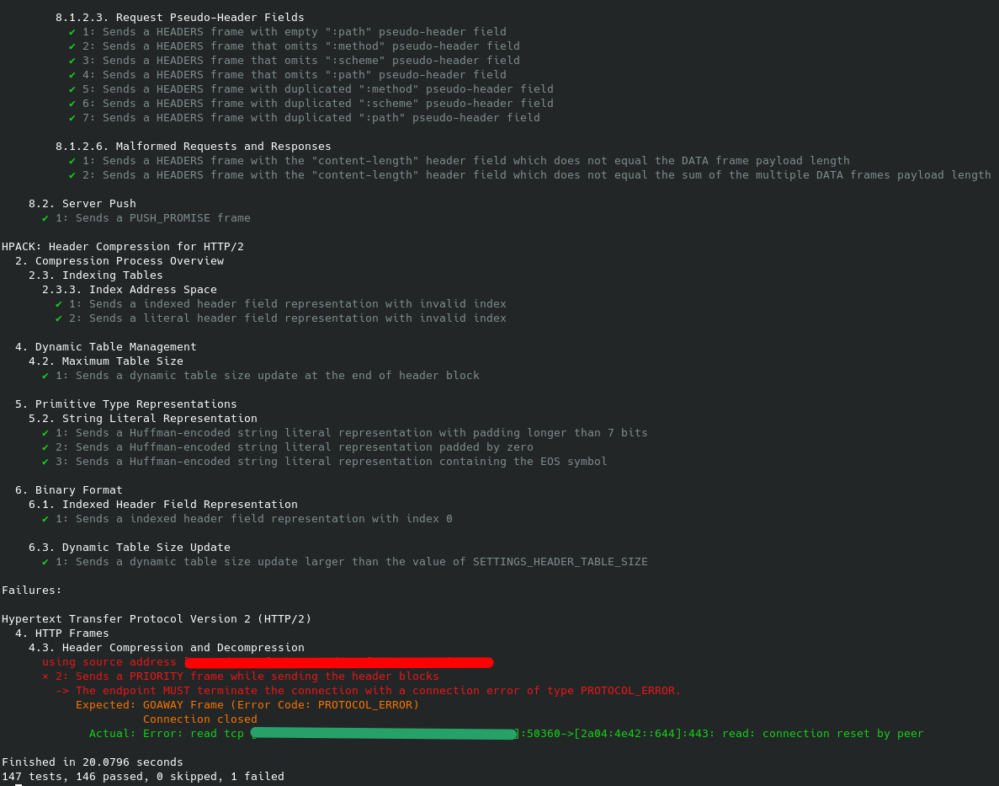 |
| :--: |
| Resultado do h2spec no apache.org |

A ferramenta h2spec executa 147 testes de conformidade da RFC. O [Apache httpd](https://httpd.apache.org) no domínio apache.org passou em 146 — uma taxa de conformidade de 99,3%, demonstrando implementação robusta do protocolo.

### Ecossistema IETF

O [IETF HTTP Working Group](https://github.com/httpwg) mantém no GitHub um repositório dedicado ao [http2-spec](https://github.com/httpwg/http2-spec/wiki/Implementations), que lista todas as implementações conhecidas do protocolo: Apache, Nginx, Caddy, Envoy, Traefik, HAProxy, e dezenas de outras.

| 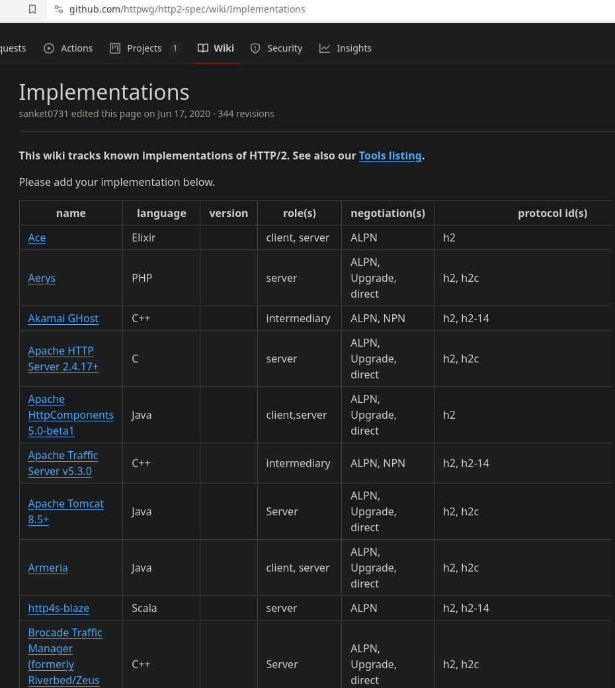 |
| :--: |
| Repositório http2-spec do IETF HTTP Working Group |

O mesmo repositório inclui uma [lista de ferramentas](https://github.com/httpwg/http2-spec/wiki/Tools) para testes e validação — desde *load testers* até *compliance checkers* como o h2spec.

Para qualquer implementação em produção, a verificação de conformidade com as RFCs é essencial. Não basta "funcionar" — é preciso garantir interoperabilidade entre clientes e servidores de diferentes fabricantes.

### HTTP/2: Não Resolve

É crucial entender os limites do protocolo. O HTTP/2 **não é uma bala de prata**. Ele não resolve:

| Problema | Por que o HTTP/2 não ajuda |
|----------|---------------------------|
| Páginas mal estruturadas | Imagens gigantes, CSS/JS sem uso, código desorganizado — isso é problema de arquitetura frontend |
| Backend lento | Se seu servidor demora 5s para processar uma query SQL, o protocolo não acelera a lógica |
| Falta de estratégia de cache | Sem `Cache-Control` bem configurado, cada requisição volta ao servidor |
| Ausência de compressão do body | Gzip/Brotli ainda são necessários — o HTTP/2 comprime headers, não bodies |
| Excesso de headers personalizados | Headers desnecessários aumentam o overhead mesmo com HPACK |
| Requisição única para um recurso | A diferença entre 1 e 2 requisições é marginal em qualquer protocolo |

> **Regra de ouro:** o HTTP/2 maximiza o potencial de uma boa aplicação web. Não salva uma aplicação ruim.

### Conclusão

Passaram-se mais de 25 anos desde a primeira versão do HTTP, e a web hoje é um ecossistema radicalmente diferente do que Tim Berners-Lee imaginou no CERN. Páginas que pesam mais de 2,6 MB com 70+ recursos na mediana não cabem nos limites de um protocolo projetado para documentos pequenos e estáticos.

O HTTP/2 não é uma evolução opcional — é uma resposta necessária à escala da web moderna. A multiplexação sobre uma única conexão TCP, a compressão de headers via HPACK, a priorização de streams e o server push reestruturam completamente a forma como cliente e servidor se comunicam. Os benchmarks deste artigo mostram resultados expressivos: de 61 segundos para menos de 2 segundos no mesmo cenário de teste, com uma única conexão TCP substituindo dezenas de conexões paralelas.

Mas o protocolo por si só não é solução mágica. Como destacado, o HTTP/2 maximiza aplicações bem construídas — e não salva aplicações mal arquitetadas. Imagens sem otimização, falta de cache, backends lentos e excessos de headers personalizados continuam sendo problemas reais que vão além do transporte.

A adoção do HTTP/2 é hoje uma decisão pragmática: suporte universal nos navegadores, maturidade nas principais implementações (Apache, Nginx, Caddy), e a migração passa por configuração de servidor, não por reescrita de código. O próximo passo — o HTTP/3 com QUIC sobre UDP. Mas, enquanto ele se consolida, o HTTP/2 continua sendo o salto mais significativo de performance disponível hoje sem mudanças na infraestrutura de rede. A pergunta nunca foi "vale a pena?". É "por que ainda não migrei?".
